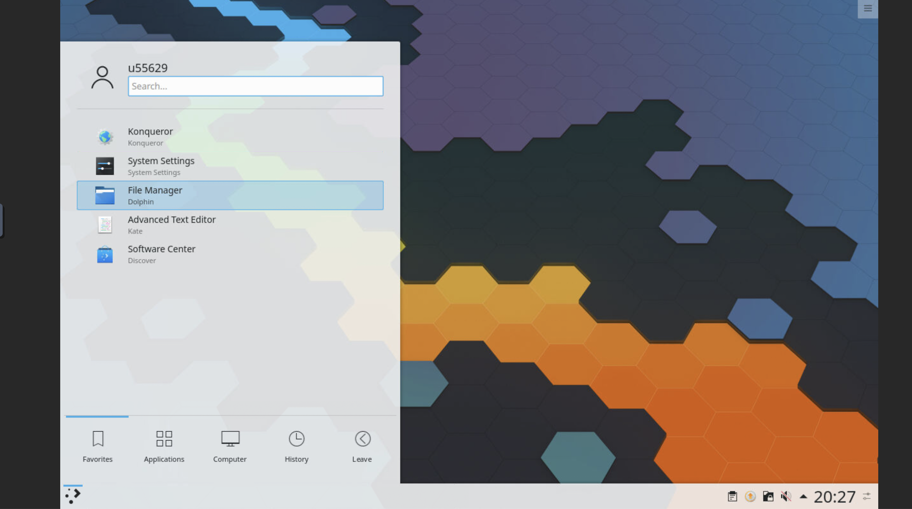

# Online-Desktop

A online KDE Desktop website can use for work




This is a Desktop use docker, KDE neon offical docker image and GUI memu, also x11vnc, and [noVNC](https://github.com/novnc/noVNC)

### Quick start

I was apply it to heroku, so please change the `$PORT` following files in order to run, or give a PORT value.

```
app/conf.dwebsockify.sh
```

and start running using docker.

### Example

https://online-desktop.herokuapp.com/vnc.html

please be patient because it need at least 2 min to start (the file was over large.)

and click the setting botton on the sidebar, change `Scaling Mode` in to `local scaling`, then click connect botton.
